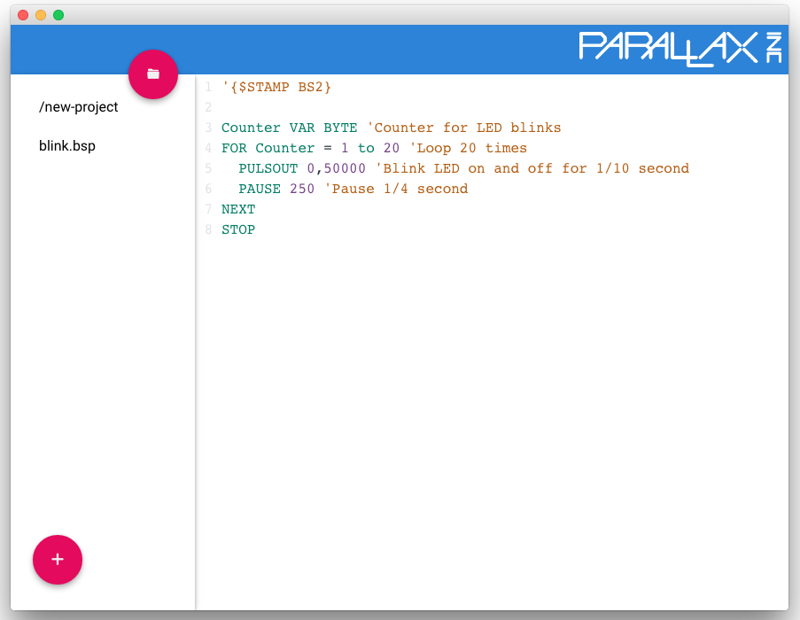

# ChromeIDE
Parallax microcontroller development environment based on Chrome application technologies.

## Building from Source/Developing

This is a one-time procedure needed to initially run the application.  To build the application you will need the node.js JavaScript runtime.  node.js itself comes bundled with the 'npm' package manager. If you don't have it, then:

1. Install node.js by going to [nodejs.org/download](https://nodejs.org/download/) and selecting the option that is right for your system.

1. You also need all the dependencies for node-gyp, a cross-platform command-line tool written in node.js for compiling native addon modules for node.js.  The gyp project is used by the Chromium team makes it easier to build across platforms.

  Please visit the [node-gyp page](https://github.com/TooTallNate/node-gyp#installation) and note your system and the dependencies you will need.

  _* Note: that you do not need to install node-gyp, only its dependencies._

1. Clone this respository.  Assuming you have `git` installed (if not, [go here](http://git-scm.com/book/en/v2/Getting-Started-Installing-Git)), choose your file destination from the command-line (CLI like Terminal), and

  ` git clone git@github.com:parallaxinc/ChromeIDE `

  

1. Go to the project root directory with

  ` cd  ChromeIDE/ `

1. Get all the project dependencies.  At the root of the project you will find `package.json`.  This manifest file includes a list of project dependencies needed to build the application. To learn more, [see this post on dependency installation](https://github.com/iceddev/getting-started/blob/master/environments/nodejs-and-npm.md#user-content-dependency-installation).

  To get dependencies, enter:

  ` npm install `

1. Build and bundle the application by entering

  `npm run build` or `npm run build -- --watch`*

  _* if you want to build on any change during development_

## Installing in Chrome

1. Open your Chrome browser and navigate to

  ` chrome://extensions `

1. Enable 'Developer Mode' by clicking the checkbox.

  

1. Before you install your extension must be built and bundled.  If you haven't done so follow the instructions in the [Build from Source](#user-content-build-from-source) section first.

1. Click on __'Load unpacked extensions...'__, go to the directory where ChromeIDE was built, highlight the *'ChromeIDE'* folder and and click select.

	
	

1. Return to the ` chrome://extensions ` page and you should see __'Parallax Chrome IDE'__ listed in available extensions.

	
1. Ensure the checkbox is *'enabled'* and click __'launch'__.
1. __Congratulations!__ You just launched ChromeIDE which will look something like this:

	

## Coming Back

One you install the built application it is super easy to launch it again.  You can either:

* go to ` chrome:// extensions `, search through the list until you find *Parallax ChromeIDE* and then click `launch'

or

* go to chrome app launcher and click on/search for *Parallax ChromeIDE*

  

  

